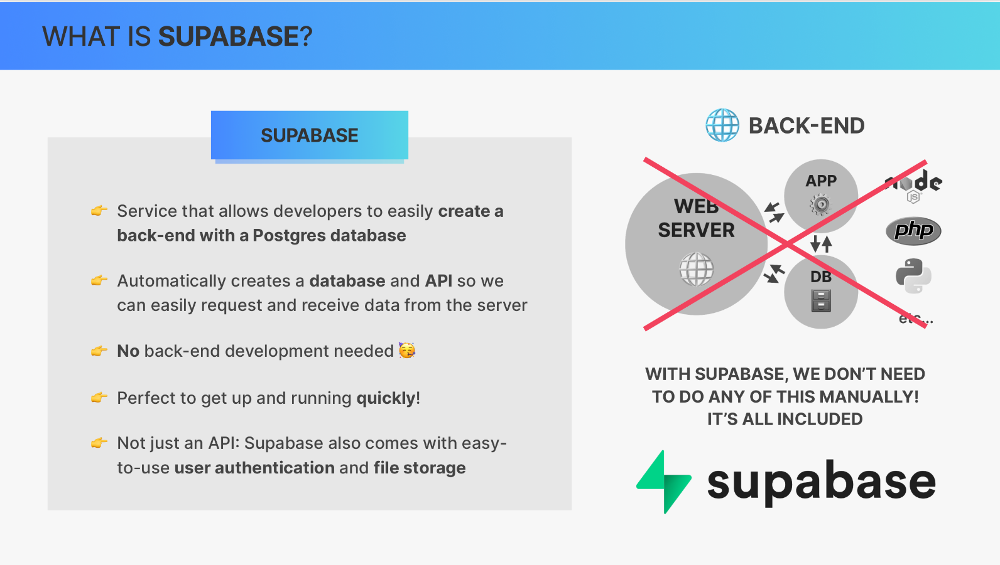

# Supabase Notes

`Superbase` is a service that allows developers easily and quickly create a backend
with a complete Postgres database.
But to us developers, it doesn't even matter what kind of database it is because we will only interface with it through an API. So this is the really nice part of Superbase because Superbase will automatically create a database and matching API so that we can very easily request and receive data from the server.

So instead of having to go through the complicated process of building a whole backend and setting up a database ourselves, we can simply let Superbase take care of all this so it's all included and automatic, no backend development needed, which is perfect for front end developers who just want to quickly get up and running with a new project.

Superbase is actually more than just an API. It's actually a complete solution that also includes user authentication and file storage and all accessible from an API or from their own JavaScript library.

So with this, you can essentially build full stack applications without knowing anything about backend development.

